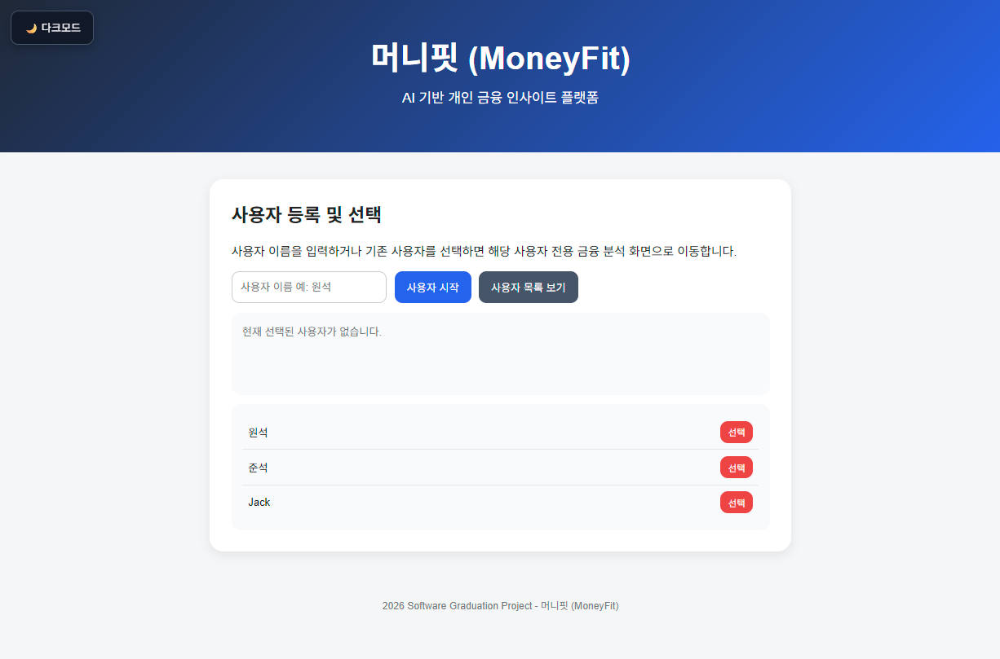
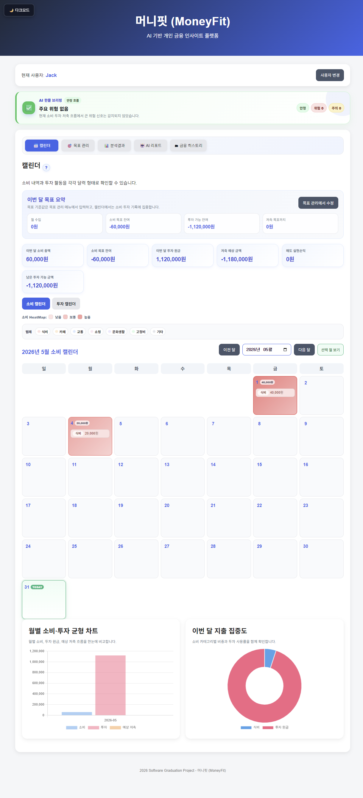
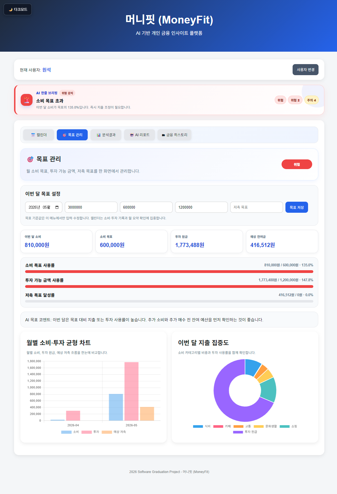
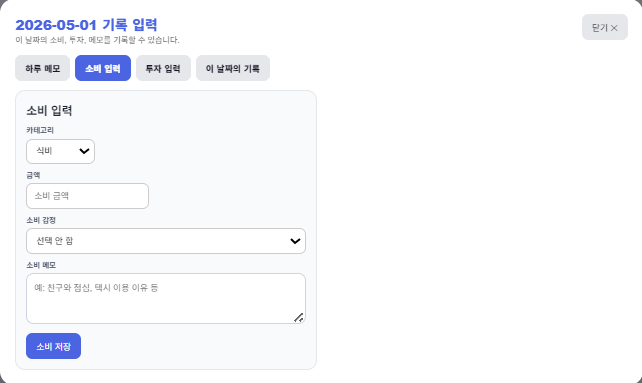
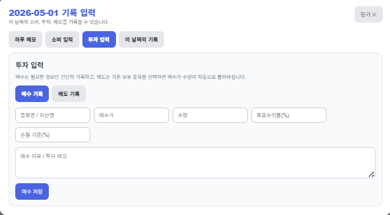
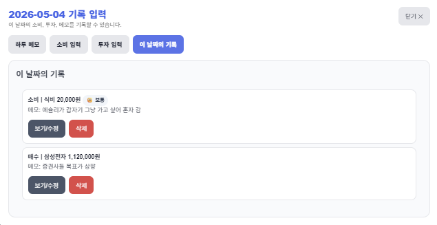
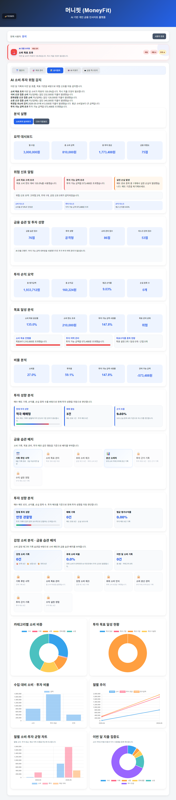
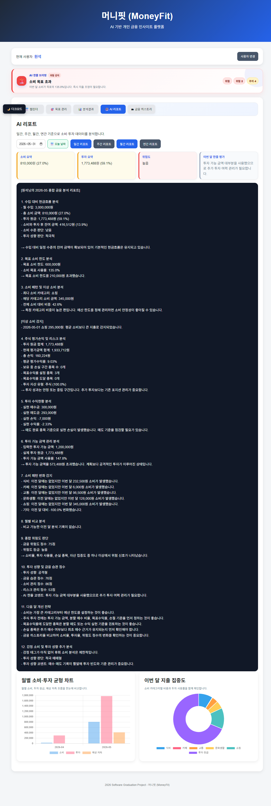
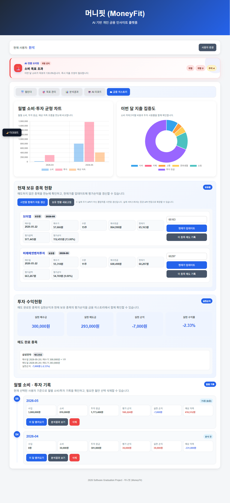

# 💰 MoneyFit

> 소비와 투자 기록을 하나의 공간에서 관리하고 분석할 수 있는 개인 금융 인사이트 플랫폼

2026 단국대학교 소프트웨어학과 졸업작품

---

# 프로젝트 소개

최근 주식 투자에 대한 관심이 높아지면서 금융 관리는 단순한 가계부 작성만으로 해결하기 어려운 영역이 되었습니다.

실제로 소비를 줄이더라도 투자 손실이 발생하면 자산이 감소할 수 있으며, 반대로 투자 수익이 발생하더라도 계획 없는 소비로 인해 금융 목표를 달성하지 못하는 경우가 많습니다.

기존 서비스들은 소비 관리 또는 투자 관리 중 한 영역에 집중되어 있는 경우가 많았고, 개인의 전체 금융 상태를 통합적으로 보여주는 서비스는 상대적으로 부족하다고 판단했습니다.

머니핏(MoneyFit)은 이러한 문제를 해결하기 위해 개발한 웹 기반 금융 관리 서비스입니다. 사용자는 소비와 투자 데이터를 함께 기록하고, 목표 달성 현황과 금융 위험도를 확인할 수 있으며, AI 분석 리포트를 통해 자신의 금융 습관을 점검할 수 있습니다.

---

# 개발 배경

주식 투자 참여 인구가 꾸준히 증가하면서 투자 또한 일상적인 금융 활동의 일부가 되었습니다.

하지만 대부분의 가계부 서비스는 소비 중심으로 구성되어 있고, 투자 서비스는 투자 성과만을 보여주는 경우가 많습니다.

본 프로젝트는 소비와 투자를 함께 관리하여 사용자의 금융 상태를 보다 직관적으로 이해할 수 있도록 하는 것을 목표로 시작되었습니다.

---

# 개발 목표

- 소비와 투자 데이터 통합 관리
- 금융 상태 시각화
- 목표 기반 금융 관리
- 투자 성과 분석
- 위험 신호 제공
- AI 기반 금융 리포트 제공

---

# 주요 기능

## 사용자 관리

- 사용자 등록 및 선택
- 사용자별 데이터 분리 저장
- 개인별 금융 데이터 관리

## 소비 관리

- 소비 내역 기록
- 카테고리 분류
- 소비 메모 작성
- 소비 달력 제공

## 투자 관리

- 주식 매수 기록
- 주식 매도 기록
- 목표 수익률 설정
- 보유 종목 관리
- 평가 손익 계산
- 실현 손익 계산

## 목표 관리

- 월 소비 목표 설정
- 투자 가능 금액 설정
- 저축 목표 설정
- 목표 달성률 확인

## 분석 기능

- 소비 분석
- 투자 분석
- 금융 위험도 분석
- 금융 행동 점수 계산
- 이상 소비 탐지

## AI 리포트

- 일간 리포트
- 주간 리포트
- 월간 리포트
- 연간 리포트

## 금융 히스토리

- 월별 금융 기록 저장
- 투자 수익 현황 조회
- 과거 데이터 비교

---

# 시스템 구성

## Front-End

- HTML5
- CSS3
- JavaScript

## 라이브러리

- Chart.js

## 데이터 저장

- Browser LocalStorage

---

# 주요 화면

## 사용자 선택 화면



사용자를 생성하거나 기존 사용자를 선택하여 개인 금융 데이터를 관리할 수 있습니다.

## 캘린더 화면



소비 및 투자 활동을 달력 형태로 확인할 수 있으며 월별 흐름을 쉽게 파악할 수 있습니다.

## 목표 관리 화면



소비 목표, 투자 가능 금액, 저축 목표를 설정하고 현재 달성률을 확인할 수 있습니다.

## 소비 입력 화면



소비 내역과 메모를 기록하여 지출 원인을 함께 관리할 수 있습니다.

## 투자 입력 화면



매수·매도 기록과 목표 수익률을 입력하여 투자 현황을 관리할 수 있습니다.

## 일일 기록 화면



특정 날짜의 소비 및 투자 기록을 확인할 수 있습니다.

## 분석 결과 화면



소비와 투자 데이터를 기반으로 금융 상태를 시각화하여 제공합니다.

## AI 리포트 화면



금융 데이터를 분석하여 리포트와 개선 방향을 제공합니다.

## 금융 히스토리 화면



보유 종목, 수익 현황, 월별 금융 기록을 확인할 수 있습니다.

---

# 프로젝트 구조

```text
MoneyFit/
├─ index.html
├─ README.md
├─ css/
│  └─ style.css
├─ js/
│  ├─ core.js
│  ├─ insight-charts.js
│  ├─ calendar-heatmap.js
│  ├─ advanced-features.js
│  └─ visible-features.js
├─ screenshots/
├─ docs/
└─ video/
```

---

# 실행 방법

1. 프로젝트 다운로드
2. index.html 실행
3. 또는 VS Code Live Server 사용

---

# 데이터 저장 방식

본 프로젝트는 별도의 서버를 사용하지 않습니다.

모든 데이터는 브라우저 LocalStorage에 저장되며 사용자별로 분리 관리됩니다.

---

# 프로젝트 한계점

본 프로젝트는 졸업작품 일정 내 구현을 목표로 개발되었기 때문에 일부 기능은 제한적으로 구현되었습니다.

- 실시간 주식 시세 API 미연동
- 증권사 계좌 연동 미지원
- 생성형 AI 기반 상담 기능 미구현
- 클라우드 데이터 동기화 미지원

현재는 사용자가 직접 투자 정보를 입력하는 구조로 구현되어 있습니다.

---

# 향후 개선 방향

- 실시간 주식 시세 연동
- 금융 뉴스 연동
- 포트폴리오 분석 기능
- 생성형 AI 금융 상담 기능
- Firebase 로그인
- 클라우드 동기화
- 모바일 앱 버전 개발

---

# 개발 후기

프로젝트를 진행하며 소비와 투자 데이터를 따로 관리하는 것보다 하나의 흐름으로 관리하는 것이 훨씬 중요하다는 점을 확인할 수 있었습니다.

또한 사용자가 데이터를 단순히 기록하는 것보다 자신의 상태를 직관적으로 이해할 수 있도록 시각화하는 과정의 중요성을 경험할 수 있었습니다.

향후에는 실제 금융 데이터와 AI 기술을 결합하여 보다 실용적인 금융 관리 플랫폼으로 발전시키고자 합니다.

---

# 프로젝트 정보

- 개발자 : 최원석
- 소속 : 단국대학교 소프트웨어학과
- 프로젝트명 : MoneyFit
- 유형 : 2026 졸업작품

---

# 시연 영상

video 폴더 또는 제출 영상 참고
